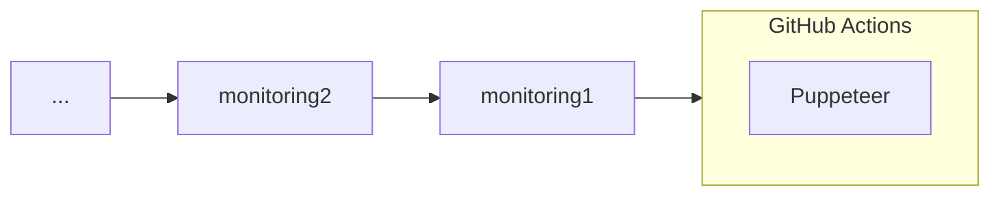
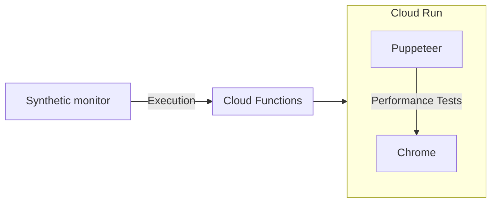

[CCoEクリスマス！クラウド技術を活用して組織をカイゼンした事例を投稿しよう！ by KINTOテクノロジーズ Advent Calendar 2023](https://qiita.com/advent-calendar/2023/kinto-technlogies) の記事です。

Qiita 運営の方からお誘いいただき参加しました。

自己紹介です。現職は、小売の買い物体験向上に取り組む Software Engineer です。

今回の題材は、「Synthetic monitoring を使用した信頼性の KAIZEN」です。

CCoE の役割の 1 つである「技術イノベーションの推進」の一環として、Synthetic monitoring を用いた信頼性の向上とサービスの KAIZEN について書きます。

さらに詳しく見たい方は読み続けてください。

## マトリョーシカ的な仕事🪆

みなさんの組織では、UI の継続的なテストは、どのように運用されていますか？

例えば、Puppeteer[^5] と GitHub Actions[^6] で自動テストを構成していたとします。

Puppeteer が継続的に動いていることをチェックしないといけないかもしれません。モニタリングを行う。



こうして、モニタリングのためのモニタリングのモニタリング、、、というようにマトリョーシカ的になりがちです。
冗長化に冗長化を重ねる。（マトリョーシカ）

## マトリョーシカからの解放

ここで Managed Service の出番です。

Managed Service は、サービスレベルを確約してくれる頼もしい存在です。

できればテスト自動化も Managed Service で完結させたい。

そこで、Synthetic monitoring[^2] の出番です。

## Synthetic monitoring
ご存知の通り、Synthetic monitoring は、2023年11月03日に GA[^1] になった Google Cloud のサービスです。

> **Cloud Monitoring**
Synthetic monitors are now GA. You can create synthetic monitors by using Terraform, the Cloud console, and the Monitoring API. You can configure your synthetic monitors to collect log data and trace data. When you use the Cloud console, the generic and Mocha templates are available:

Synthetic monitoring は、テスト対象と一連のテストを定義できます。Node.js で。
例えば、Login から遷移先の画面のテストを自動化することができます。

今回、CCoE として、サービスの信頼性チェックを自動化する方法について、考察します。

## Let's get started.
今回、テストに Puppeteer[^7] を使います。
テストの内容は、ホームページのパフォーマンス テストです。ページのロード時間を測定します。

公式の Docs[^8]



検証用の合成モニターを作成します。

### Create a Function
- Ensure that more memory is available.　`--memory`
- Set a longer timeout. `--timeout`
```bash
sudo gcloud functions deploy $FUNC_NAME \
  --gen2 --region=$REGION --source="." \
  --entry-point=CustomPuppeteerSynthetic --trigger-http --runtime=nodejs18 --project=$PROJECT_ID --memory=2G --timeout=60
```

### Create a synthetic monitor
```bash
sudo curl https://monitoring.googleapis.com/v3/projects/${PROJECT_ID}/uptimeCheckConfigs \
 -H "Authorization: Bearer ${ACCESS_TOKEN}" \
 -H "Content-Type: application/json" --request POST \
 --data '{ "displayName": "'"${DISPLAY_NAME}"'", "synthetic_monitor": {"cloud_function_v2": {"name": "'"${FUNCTION_NAME}"'"} },}'
```

### This is the synthetic monitor.


この通り、テストが定期実行されていることがわかります。

ページの SLO が決まっていて、それを即座に監視したい場合は、Log Based Alerts[^9] を設定することをお勧めします。例えば、こんな感じで。
あとは、Slack や SMS などに異常を通知させる。
```sql
textPayload:"milliseconds"
```

最後に、今回の記事で使用したコードはこちらです。

https://github.com/danny-yamamoto/synthetic-monintoring

KAIZEN 活動の報告は以上です。

この投稿をみて何か得られた方は、いいね ❤️ をお願いします。

それでは、次回のアドカレでお会いしましょう。👋

## BTW

ちなみに、Google Cloud の Monitoring には、類似のサービスがもう 1 つあります。
- Uptime checks[^3]
   - 公開されている URL または Google Cloud リソースに対してリクエストを発行し、事前定義した response code に基づいたチェックを行えます。簡単にいうと Health Check の Managed Service です。

https://cloud.google.com/monitoring/uptime-checks/introduction#about-uptime

例に漏れず、僕は、Uptime checks の Heavy User です。

[^1]: 一般公開
[^2]: https://cloud.google.com/monitoring/uptime-checks/introduction
[^3]: https://cloud.google.com/monitoring/uptime-checks/introduction#about-uptime
[^4]: https://cloud.google.com/monitoring/uptime-checks/introduction#about-sm
[^5]: Node.js環境で動作し、JavaScriptやTypeScriptでスクリプトを書くことができます。ウェブ開発者やテスターにとって非常に便利なツールです。
[^6]: あらかじめ定義した処理と条件の組合せ（＝ワークフロー/Workflow）を自動化するGitHub公式の機能です。GitHub Actionsではリポジトリに対するプッシュなどの処理をトリガーとして、専用のWorkflowに定義しておいた処理を自動で実行します。
[^7]: 主にブラウザの自動化とページのテストのための Node ライブラリです。
[^8]: https://github.com/GoogleCloudPlatform/synthetics-sdk-nodejs/blob/b150be2a7f25face543832b1721c77eb680a5c71/samples/generic-puppeteer-nodejs/README.md
[^9]: https://cloud.google.com/logging/docs/alerting/log-based-alerts?hl=ja
